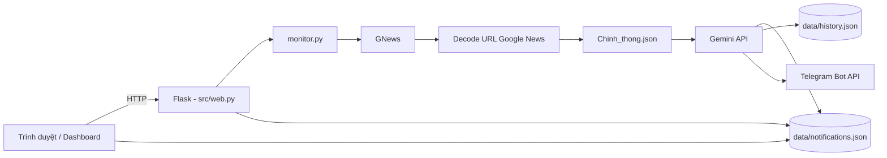

# Hướng dẫn hệ thống giám sát tin tức

Tài liệu mô tả toàn bộ cách cài đặt, sử dụng, cấu trúc thư mục và luồng xử lý của dự án **Phan_mem** (chạy qua `He_thong.py`).

---

## 1. Hệ thống là gì?

Ứng dụng web giúp:

- Theo dõi **đối tượng** (lãnh đạo, nhân vật công chúng…) trên **Google News**
- Phân loại tin bằng **Google Gemini AI**: có liên quan không, có hoạt động không, có **thay đổi chức vụ** không
- Lưu kết quả theo **hai kênh**: hoạt động và biến động chức vụ
- Hiển thị **bảng điều khiển** (dashboard) theo khung thời gian (giờ)
- Gửi **báo cáo Telegram** sau mỗi lần quét (tùy chọn): có hoạt động / biến động thì báo chi tiết; không có gì trong cửa sổ báo cáo thì vẫn gửi tin *trống* để biết đã quét

**Quét tự động nền** theo chu kỳ (`auto_scan_enabled`, `scan_interval_minutes`) — dashboard tự làm mới khi có lượt quét mới. Có thể **Quét tất cả** hoặc **Quét riêng** từng đối tượng. Giao diện hỗ trợ **sáng / tối** (lưu trên trình duyệt).

---

## 2. Sơ đồ hoạt động



**Một lần quét (`process_once`):**

1. Đọc danh sách đối tượng từ `config/config.json` (hoặc **một đối tượng** nếu quét riêng)
2. Với mỗi đối tượng: tìm tin trên Google News (2 truy vấn: hoạt động + từ khóa chức vụ)
3. Giải mã link Google News → link báo thật
4. (Tùy chọn) Lọc chỉ báo trong `Chinh_thong.json`
5. Bỏ qua URL đã xử lý (`history.json`)
6. Gửi từng bài mới cho Gemini phân tích
7. Lưu bài đủ điều kiện vào `notifications.json`
8. Gửi Telegram (nếu bật): **một tin / đối tượng / lần quét** — báo cáo đầy đủ hoặc tin trống  
9. **Lặp lại** bước 1–8 theo chu kỳ (mặc định 15 phút) nếu bật quét tự động

---

## 3. Cấu trúc thư mục

```
Phan_mem/
├── He_thong.py              # Điểm chạy: python He_thong.py → cổng 8000
├── requirements.txt         # Thư viện Python
├── HUONG_DAN.md             # File này
│
├── config/                  # Cấu hình (nên sao lưu)
│   ├── config.json          # API Gemini, đối tượng, Google News, Telegram
│   └── Chinh_thong.json     # Danh sách báo chính thống (domain)
│
├── data/                    # Dữ liệu chạy (tự tạo/cập nhật)
│   ├── notifications.json   # Tin đã lưu (2 kênh)
│   ├── history.json         # URL đã quét (tránh gọi AI trùng)
│   ├── telegram_sent.json   # Khóa tin Telegram đã gửi
│   └── url_decode_cache.json # Cache decode link Google News
│
├── src/                     # Mã nguồn Python
│   ├── web.py               # Flask: giao diện + REST API
│   ├── monitor.py           # Quét tin, AI, lưu, Telegram
│   ├── auto_scanner.py      # Quét nền theo chu kỳ
│   ├── telegram_notify.py   # Gửi tin nhắn Telegram
│   ├── press_whitelist.py   # Lọc domain báo
│   ├── json_io.py           # Đọc/ghi JSON an toàn
│   └── paths.py             # Đường dẫn config/data/templates
│
├── templates/               # HTML
│   ├── dashboard.html       # Trang chính
│   └── target_detail.html   # Chi tiết từng đối tượng
│
├── static/
│   ├── css/isr-theme.css
│   └── js/
│       ├── dashboard.js
│       ├── settings.js
│       └── theme.js         # Giao diện sáng / tối (localStorage)
│
└── emip.v3.js               # (Tùy chọn) Script Qime/Telegram riêng — KHÔNG gắn vào hệ thống này
```

---

## 4. Cài đặt lần đầu

### 4.1. Yêu cầu

- Windows (hoặc OS có Python 3.10+)
- Kết nối Internet (Google News, Gemini, Telegram)

### 4.2. Cài thư viện

Mở terminal trong thư mục `Phan_mem`:

```bash
python -m venv .venv
.venv\Scripts\activate
pip install -r requirements.txt
```

### 4.3. Cấu hình bắt buộc

Mở `config/config.json` và điền ít nhất:

| Trường           |                   Ý nghĩa                       |
|------------------|-------------------------------------------------|
| `gemini_api_key` | API key Google AI / Gemini                      |
| `targets`        | Danh sách `{ "name", "position" }` cần theo dõi |

Có thể chỉnh thêm trong `google_news` (ngôn ngữ, số tin tối đa, lọc báo…).

### 4.4. Chạy server

```bash
python He_thong.py
```

Mở trình duyệt: **http://localhost:8000**

Dừng server: `Ctrl+C` trong terminal.

---

## 5. Hướng dẫn sử dụng giao diện

### 5.1. Trang chính (Dashboard)

| Thành phần | Chức năng |
|------------|-----------|
| **Giao diện sáng / tối** | Nút ngay **dưới Cài đặt hệ thống** (sidebar trái); chỉ đổi màu, giữ bố cục; lưu trên trình duyệt (`localStorage`, key `ui-theme`) |
| **Thời gian tìm kiếm** | Số giờ hiển thị báo cáo (ưu tiên giá trị trên UI, không ghi đè bởi config khi xem) |
| **Đối tượng** | Thêm / sửa / xóa tên và chức vụ; nút ▶ **Quét riêng** trên từng dòng |
| **Quét tất cả** | Quét Google News + AI cho **toàn bộ** đối tượng (nút xanh góc phải header) |
| **Quét riêng** | Chỉ quét **một** đối tượng: nút ▶ trên sidebar, nút **Quét riêng** trên thẻ kết quả, hoặc trang chi tiết |
| **Tải lại** | Làm mới danh sách thẻ tóm tắt |
| **Cài đặt hệ thống** | Lọc báo, quét tự động, Telegram, danh sách báo chính thống |

**Cột phải dashboard**

| Panel | Nội dung |
|-------|----------|
| **Trạng thái hệ thống** | KPI (Đối tượng / Biến động / Có hoạt động), quét tự động, chu kỳ, trạng thái, **Lần quét cuối** (thời điểm cụ thể `dd/mm/yyyy, hh:mm:ss`), Telegram |
| **Tin mới nhất** | Danh sách tin gần đây trong cửa sổ giờ đã chọn |

**Thẻ kết quả quét:** tóm tắt theo đối tượng (hoạt động / chức vụ, trạng thái, snippet); không hiển thị thời gian dạng “X phút trước”.

**Sửa đối tượng:** chọn tên trong danh sách → sửa ô Họ tên / Chức vụ → **Thêm** (nút đổi thành lưu) hoặc **Hủy**.

**Xem chi tiết:** bấm vào thẻ đối tượng hoặc mũi tên → trang `/target?name=...` với hai mục **Hoạt động** và **Chức vụ**, nút **Quét riêng** và tải JSON.

### 5.2. Trang chi tiết đối tượng

| Thành phần | Chức năng |
|------------|-----------|
| **Quét riêng** | Quét chỉ đối tượng đang xem (dùng `hours` trên URL) |
| **Giao diện sáng / tối** | Nút trên thanh trên cùng |
| **Tải JSON** | Xuất dữ liệu trong cửa sổ giờ |

### 5.3. Cài đặt hệ thống

**Lọc khi quét**

| Tùy chọn | Mặc định khuyến nghị | Ý nghĩa |
|----------|----------------------|---------|
| Chỉ báo chính thống | Bật | Chỉ giữ tin từ domain trong `Chinh_thong.json` |
| Gộp tin trùng | Tắt | Tính năng nâng cao (hiện tắt trong config) |
| Phân cụm sự kiện (AI) | Tắt | Model nặng, chậm |
| Số tin tối đa / đối tượng | 15–35 | Giới hạn mỗi truy vấn GNews |
| Quét RSS báo chính thống | Bật | Link trực tiếp từ feed, nhanh hơn decode Google News |

**Quét tự động (real-time)**

| Tùy chọn | Ý nghĩa |
|----------|---------|
| Bật quét nền | Tự quét theo chu kỳ khi server đang chạy |
| Chu kỳ quét (phút) | Tối thiểu 5 phút |
| Làm mới giao diện (giây) | Dashboard poll `/api/monitor/status` và tải lại khi có quét mới |

**Thông báo Telegram**

| Tùy chọn | Ý nghĩa |
|----------|---------|
| Bật gửi Telegram | Bật/tắt gửi sau mỗi lần quét |
| Chỉ thông báo thay đổi chức vụ | Bật = chỉ gửi khi có biến động chức vụ trong cửa sổ báo cáo (hoặc tin mới có `Is_Change`) |
| Bot token | Token từ @BotFather |
| Chat ID | ID chat **người nhận** (bạn / nhóm), **không** phải ID bot |
| Gửi thử | Kiểm tra kết nối trước khi lưu |

**Danh sách báo chính thống:** thêm tên báo + URL trang chủ; lưu vào `config/Chinh_thong.json`.

---

## 6. File cấu hình và dữ liệu

### 6.1. `config/config.json`

Ví dụ cấu trúc (dùng placeholder, không copy key thật vào tài liệu công khai):

```json
{
  "gemini_api_key": "YOUR_GEMINI_API_KEY",
  "gemini_model": "gemini-2.5-flash",
  "auto_scan_enabled": true,
  "scan_interval_minutes": 15,
  "ui_refresh_seconds": 30,
  "google_news": {
    "language": "vi",
    "country": "VN",
    "max_results_per_target": 15,
    "filter_chinh_thong_only": true,
    "use_rss_feeds": true,
    "activity_report_hours": 24,
    "role_change_report_hours": 168,
    "merge_duplicate_articles": false,
    "use_event_intelligence": false
  },
  "targets": [
    { "name": "Tên đối tượng", "position": "Chức vụ tham chiếu" }
  ],
  "telegram": {
    "enabled": false,
    "bot_token": "",
    "chat_id": "",
    "notify_role_change_only": false
  }
}
```

| Khối / trường | Ghi chú |
|---------------|---------|
| `auto_scan_enabled` | Bật/tắt quét nền (có thể đổi trên UI) |
| `scan_interval_minutes` | Chu kỳ quét nền (phút, tối thiểu 5) |
| `ui_refresh_seconds` | Tần suất dashboard kiểm tra quét mới (10–120 giây) |
| `activity_report_hours` | Chỉ dùng khi UI **không** truyền `hours` (fallback) |
| `role_change_report_hours` | Cửa sổ riêng cho kênh chức vụ khi xem báo cáo |
| `telegram` | Lưu khi bấm **Lưu cài đặt** trên UI |

### 6.2. `config/Chinh_thong.json`

Mảng các object:

```json
[
  {
    "name": "VnExpress",
    "homepage_url": "https://vnexpress.net/",
    "rss_url": "https://vnexpress.net/rss/tin-moi-nhat.rss"
  }
]
```

Hệ thống lấy **domain** từ URL để so khớp link bài báo sau khi decode.

### 6.3. `data/notifications.json`

```json
{
  "channel_hoatdong": [ /* mọi tin hoạt động đã lưu */ ],
  "channel_biendong": [ /* chỉ tin có thay đổi chức vụ */ ]
}
```

Mỗi bản ghi thường có: `timestamp`, `target_name`, `target_position`, `title`, `description`, `url`, `resolved_url`, `press_name`, `news_kind`, `ai_result` (JSON từ Gemini).

### 6.4. `data/history.json`

Mảng chuỗi dạng `"Tên đối tượng|URL"` — đã gọi Gemini (kể cả bài bị loại). Tránh quét trùng URL.

**Lưu ý:** URL đã có trong `history.json` sẽ **không** được xử lý lại ở lần quét sau → `processed_new = 0` là bình thường. Telegram vẫn có thể gửi (báo cáo hoặc tin trống) tùy dữ liệu trong `notifications.json`.

### 6.5. `data/telegram_sent.json`

Mảng chuỗi khóa đã gửi Telegram, ví dụ:

| Dạng khóa | Ý nghĩa |
|-----------|---------|
| `Tên đối tượng\|https://...` | Bài báo đã gửi (không gửi lại cùng URL) |
| `Tên đối tượng\|empty_status` | Đã gửi tin trống (không gửi lại đến khi có tin mới) |

Có thể xóa file này nếu muốn **gửi lại** toàn bộ (cẩn thận trùng tin trên Telegram).

---

## 7. Luồng quét và phân loại AI

### 7.1. Hai loại truy vấn Google News

| Loại | Truy vấn | `news_kind` |
|------|----------|-------------|
| Hoạt động | Tên đối tượng | `hoatdong` |
| Biến động chức vụ | Tên + từ khóa (bổ nhiệm, miễn nhiệm…) | `biendong` |

Cùng một bài có thể xuất hiện ở cả hai truy vấn. Hệ thống **ưu tiên biến động chức vụ**: nếu trùng URL, bài **hoạt động** bị bỏ — chỉ phân tích **một lần** (loại `biendong`).

### 7.1.1. RSS báo chính thống (nhanh)

Khi `use_rss_feeds: true`, hệ thống đọc feed từ `Chinh_thong.json` (trường `rss_url` hoặc RSS mặc định theo domain), lọc bài có tên đối tượng. Link RSS **trực tiếp** — không cần decode Google News.

| Tối ưu | Mô tả |
|--------|--------|
| **A** | URL đã trong `history.json` → bỏ qua **trước** bước decode |
| **B** | Decode Google News **song song** + cache `data/url_decode_cache.json` |
| **C** | Gọi Gemini **song song** (`gemini_workers`, mặc định 3) |

Cấu hình trong `google_news`:

```json
"use_rss_feeds": true,
"rss_max_per_feed": 40,
"decode_workers": 4,
"gemini_workers": 3,
"decode_interval": 0.15
```

### 7.2. Kết quả Gemini (`ai_result`)

| Trường | Ý nghĩa |
|--------|---------|
| `Matched_Target` | Bài có đúng đối tượng không |
| `Is_Activity` | Có nói về hoạt động/việc làm không |
| `Is_Change` | Có thay đổi chức vụ không |
| `Summary` | Một câu tóm tắt theo quy tắc prompt |
| `Confidence` | 0–100 |

**Lưu vào hệ thống** chỉ khi: `Matched_Target` và `Is_Activity` đều true.

- Luôn thêm vào `channel_hoatdong`
- Thêm vào `channel_biendong` nếu `Is_Change` true

### 7.3. Cửa sổ thời gian trên UI

Khi gọi API với `?hours=24`, hệ thống **ưu tiên 24 giờ** từ giao diện để lọc tin hiển thị — không bị `activity_report_hours` trong config ghi đè.

---

## 8. Telegram — cấu hình chi tiết

### 8.1. Tạo bot

1. Telegram → **@BotFather** → `/newbot`
2. Copy **token** → dán vào cài đặt

### 8.2. Lấy Chat ID (chat cá nhân)

1. Mở bot của bạn → **Start** (`/start`)
2. Trình duyệt: `https://api.telegram.org/bot<TOKEN>/getUpdates`
3. Tìm `"chat":{"id": 123456789` → đó là Chat ID (số dương)

### 8.3. Nhóm / kênh

- Thêm bot vào nhóm, gửi một tin trong nhóm
- Gọi lại `getUpdates` → ID nhóm thường **âm** (ví dụ `-1001234567890`)

### 8.4. Lỗi thường gặp

| Thông báo | Nguyên nhân | Cách xử lý |
|-----------|-------------|------------|
| `can't send messages to the bot` | Chat ID là ID của bot | Dùng ID người/nhóm nhận |
| `Chat not found` | Sai Chat ID | Kiểm tra lại getUpdates |
| `Unauthorized` | Sai token | Tạo lại token BotFather |
| `bot was blocked` | Đã chặn bot | Mở bot, bấm Start |

### 8.5. Khi nào gửi tin? (sau mỗi lần quét)

Telegram bật → với **mỗi đối tượng**, tối đa **một tin** mỗi lần quét (tự động hoặc thủ công). **Không gửi lại** báo cáo đầy đủ nếu tin đã gửi trước đó.

| Tình huống | Tin gửi đi |
|------------|------------|
| Có **tin mới** lần này (URL chưa gửi Telegram) | **Báo cáo đầy đủ** (một lần), rồi ghi nhớ URL |
| Không tin mới, nhưng vẫn còn hoạt động cũ trong cửa sổ 24h | **Không gửi** (tránh spam) |
| Không tin mới, không hoạt động / biến động trong cửa sổ | Tin **trống** (*Không có hoạt động*) — **một lần** cho đến khi có tin mới |
| Đã gửi tin trống rồi, các lần quét sau vẫn không có gì | **Không gửi lại** |

**Tùy chọn “Chỉ thông báo thay đổi chức vụ”:** chỉ áp dụng khi có **tin mới**; tin trống vẫn gửi khi không có gì trong cửa sổ.

### 8.5.1. Quét tự động nền

- Chu kỳ: `scan_interval_minutes` (tối thiểu **5 phút**), đọc lại từ `config.json` **mỗi vòng**.
- Thời gian chờ tính từ **đầu chu kỳ** (sau khi quét xong, chờ phần còn lại của chu kỳ).
- **Lưu cài đặt** → chu kỳ mới áp dụng ngay (không cần khởi động lại server).
- Một lần quét có thể kéo dài (GNews + AI) — lần quét tiếp theo không bắt đầu cho đến khi hết chu kỳ.

### 8.6. Mẫu nội dung tin nhắn

Tiêu đề chung mỗi tin:

```text
📋 Báo cáo giám sát — 18/05/2026 15:30
```

**Tin trống** (không có hoạt động / biến động trong cửa sổ):

```text
1. Đồng chí Tô Lâm:
- Thay đổi chức vụ: Không
- Hoạt động trong 24 giờ: Không có hoạt động
```

**Báo cáo đầy đủ:**

```text
1. Đồng chí Tô Lâm:
- Thay đổi chức vụ: Có
- Hoạt động trong 24 giờ:
	+ Hoạt động 1: Tóm tắt từ AI hoặc tiêu đề bài
	Link bài: https://...
	+ Hoạt động 2: ...
	Link bài: https://...
```

Nhiều đối tượng → **nhiều tin riêng** (mỗi đối tượng một tin Telegram).

### 8.7. Log terminal khi gửi Telegram

| Dòng log | Ý nghĩa |
|----------|---------|
| `[TELEGRAM] đã gửi (trống): Tên` | Tin trống đã gửi |
| `[TELEGRAM] đã gửi báo cáo: Tên (N hoạt động / 24h)` | Báo cáo đầy đủ |
| `[TELEGRAM] FAIL ...` | Lỗi API — xem mục 8.4 |

Trên dashboard, sau quét có thể thấy: `Telegram: 2 tin (1 trống)` — số trong ngoặc là tin trống.

---

## 9. API HTTP (tham khảo)

Base: `http://localhost:8000`

| Method | Đường dẫn | Mô tả |
|--------|-----------|--------|
| GET | `/` | Dashboard |
| GET | `/target?name=...&hours=24` | Trang chi tiết |
| GET | `/config` | Đọc config |
| POST | `/config/targets/add` | Thêm/sửa đối tượng (`original_name` khi sửa) |
| POST | `/config/targets/update` | Tương thích cũ |
| POST | `/config/targets/delete` | Xóa đối tượng |
| GET | `/notifications` | Đọc notifications.json |
| GET | `/api/targets/summary?hours=24` | Tóm tắt tất cả đối tượng |
| GET | `/api/target/detail?name=...&hours=24` | Chi tiết một đối tượng |
| GET | `/api/target/export.json?name=...&hours=24` | Tải JSON |
| GET | `/api/settings` | Cài đặt + danh sách báo |
| POST | `/api/settings` | Lưu cài đặt |
| POST | `/api/settings/telegram-test` | Gửi tin thử Telegram |
| GET | `/api/monitor/status` | Trạng thái quét tự động (đang quét, lần cuối, lần tới) |
| POST | `/monitor/run` | Chạy quét một lần (thủ công). Body JSON: `{ "scan_hours": 24, "target_name": "Tên (tùy chọn)" }` — bỏ `target_name` = quét tất cả |

Phản hồi quét thành công (rút gọn):

```json
{
  "success": true,
  "processed_new": 0,
  "scanned_target": "Tô Lâm",
  "scanned_targets": ["Tô Lâm"],
  "telegram_sent": 2,
  "telegram_sent_empty": 2,
  "telegram_skipped_dup": 0,
  "telegram_skipped_filter": 0,
  "telegram_errors": [],
  "telegram_enabled": true,
  "skipped_history_dup": 15,
  "history_size": 150,
  "timestamp": "2026-05-18T14:00:00"
}
```

| Trường | Ý nghĩa |
|--------|---------|
| `processed_new` | Số bài **mới** lưu trong lần quét này |
| `scanned_target` | Tên đối tượng khi quét riêng; `null` khi quét tất cả |
| `scanned_targets` | Danh sách đối tượng thực sự được quét |
| `telegram_sent` | Số tin Telegram đã gửi (trống + đầy đủ) |
| `telegram_sent_empty` | Trong đó bao nhiêu tin **trống** |
| `skipped_history_dup` | URL bỏ qua vì đã có trong `history.json` |

**Ví dụ quét riêng (curl):**

```bash
curl -X POST http://localhost:8000/monitor/run ^
  -H "Content-Type: application/json" ^
  -d "{\"scan_hours\": 24, \"target_name\": \"Tô Lâm\"}"
```

---

## 10. Module mã nguồn (tóm tắt)

|         File             |                      Vai trò                         |
|--------------------------|------------------------------------------------------|
| `He_thong.py`            | Khởi chạy Flask `0.0.0.0:8000`                       |
| `src/web.py`             | Route, API, render HTML                              |
| `src/auto_scanner.py`    | Vòng lặp quét nền, khóa tránh quét chồng, `/api/monitor/status` |
| `src/monitor.py`         | `process_once()`, Gemini, GNews, RSS, báo cáo        |
| `src/telegram_notify.py` | `format_target_digest`, `format_target_empty`, `notify_records` |
| `src/press_whitelist.py` | `PressWhitelist.from_file`, `is_allowed_url`         |
| `src/json_io.py`         | `read_json` / `write_json` (file `.tmp` rồi replace) |
| `src/paths.py`           | Đường dẫn; migrate file JSON cũ từ thư mục gốc       |

Chạy thử logic quét từ dòng lệnh (không qua web):

```bash
python -m src.monitor
```

---

## 11. Bảo mật và vận hành

- **Không** chia sẻ `config/config.json` (chứa API key Gemini, token Telegram).
- **Không** commit file config có key thật lên Git công khai.
- Sau khi sửa code Python: **khởi động lại** `python He_thong.py` (chỉ chạy **một** tiến trình trên cổng 8000).
- Sau khi sửa HTML/JS/CSS: **Ctrl+F5** trên trình duyệt (template có tham số `?v=` để bust cache).
- Giao diện sáng/tối: file `static/js/theme.js`, CSS block `html[data-theme="light"]` trong `isr-theme.css`.
- File `emip.v3.js` (nếu có) là script **Qime/Telegram riêng** trên trình duyệt; hệ thống giám sát **không đọc** file đó — cấu hình Telegram hoàn toàn qua UI/`config.json`.

---

## 12. Khắc phục sự cố

|       Triệu chứng      |                         Hướng xử lý                               |
|------------------------|-------------------------------------------------------------------|
| `Thiếu gemini_api_key` | Điền key trong `config/config.json`                               |
| Quét không có tin mới  | Bình thường nếu URL đã trong `history.json`; Telegram vẫn có thể gửi tin trống (mục 8.5) |
| Không thấy tin Telegram | Kiểm tra **Bật gửi Telegram** + token/chat_id; **Gửi thử**; khởi động lại server sau sửa code |
| Chỉ thấy `[SCAN]`, không `[ARTICLE]` | Không có URL mới — xem `telegram_sent_empty` trong phản hồi quét |
| Quét không có tin      | Tăng `max_results_per_target`; tắt tạm lọc báo chính thống để thử |
| UI vẫn 24h dù chọn 1h  | Khởi động lại server; Ctrl+F5; kiểm tra đã bấm ✓ áp dụng giờ      |
| UI cũ (không thấy nút mới) | Nhiều server trùng cổng 8000 — dừng hết (`Ctrl+C`), chạy lại **một** lần `python He_thong.py`; Ctrl+F5 |
| Không thấy **Giao diện sáng** | Nút ở sidebar, **dưới Cài đặt hệ thống**; Ctrl+F5 hoặc tab ẩn danh |
| Quét riêng báo lỗi đối tượng | Tên `target_name` phải khớp chính xác với `config.json` |
| Quét tự động dừng sau 1 lần | Windows lỗi in tiếng Việt (`charmap`) làm thread nền chết — khởi động lại server (bản mới đã sửa); xem `last_scan_ok` / `last_error` tại `/api/monitor/status` |
| Lưu đối tượng lỗi 404  | Khởi động lại server sau khi cập nhật code                        |
| Gemini 429             | Hết quota; đợi hoặc đổi model/key                                 |
| Telegram 400           | Xem mục 8.4                                                       |

Log quét in trong terminal khi chạy `He_thong.py` (dòng `[SCAN]`, `[ARTICLE]`, `[AI]`, `[TELEGRAM]`).

---

## 13. Phụ lục — Di chuyển từ bản cũ (file ở thư mục gốc)

Nếu trước đây có `config.json`, `notifications.json` ngay trong `Phan_mem/`:

- Lần chạy đầu, `src/paths.py` **tự copy** sang `config/` và `data/` nếu chưa có file mới.
- Nên dùng đường dẫn mới: `config/config.json`, `data/notifications.json`.

---

*Tài liệu cập nhật: quét riêng từng đối tượng, giao diện sáng/tối, dashboard (Trạng thái hệ thống + Tin mới nhất), quét tự động nền, Telegram báo cáo theo đối tượng.*
